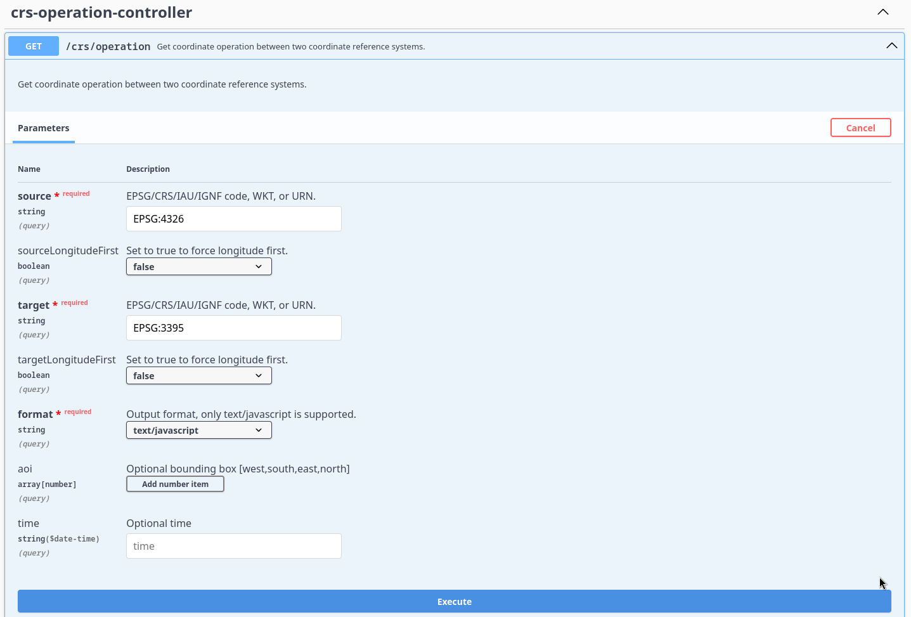
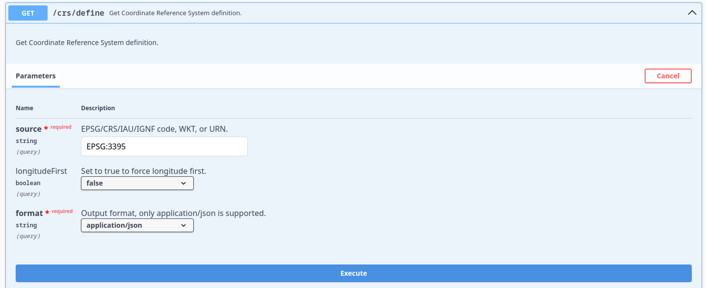

= Reprojection formula web service
:toc:
:toclevels: 2
:toc: left

include::features.adoc[]

include::configure_deployment.adoc[]

== Documentation OpenAPI 3

API documentation is available on running service on URI path : *./swagger-ui.html*

.Overview of conversion formula REST API

.Overview of coordinate system description REST API

== Usage examples

- *JavaScript* : xref:./exemple_javascript_epsg3031.adoc[Conversion from EPSG:4326 to Polar Stereographic (EPSG:3031)]
- *NodeJS* : xref:./exemple_nodejs_epsg3031.adoc[Conversion from EPSG:4326 to Polar Stereographic (EPSG:3031)]
- *OpenLayers* : xref:./exemple_openlayer_epsg3031.adoc[Display OpenStreetMap using Antarctic Polar Stereographic (EPSG:3031) projection]
- *Python* : xref:./exemple_python_epsg3031.adoc[Conversion from EPSG:4326 to Polar Stereographic (EPSG:3031)]
+
[WARNING]
====
Python formula is a work on progress, it might not work yet.
====
